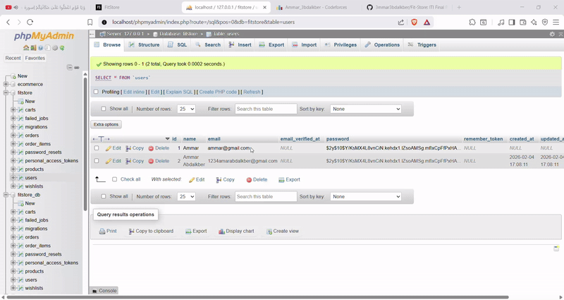

<h1 align="center"> FitStore — E-Commerce Clothing Platform</h1>

<p align="center">
  A modern, responsive e-commerce platform built with <strong>Laravel</strong> for ITI Final Project.<br/>
  Shop fashion collections with cart functionality, wishlists, orders, and admin management.
</p>

<p align="center">
  <!-- Shields -->
  <a href="https://laravel.com/"></a>
  <a href="https://php.net/"></a>
  <a href="https://www.mysql.com/"></a>
  <a href="https://getbootstrap.com/"></a>
  
</p>

<p align="center">
  <a href="#features">Features</a> •
  <a href="#demo">Demo</a> •
  <a href="#tech-stack">Tech Stack</a> •
  <a href="#project-structure">Structure</a> •
</p>

---

## Features

###  **Shopping Experience**
- **Product Catalog** with categories (Summer, Winter, All Collections)
- **Advanced Search** with instant results
- **Product Details** with multiple images, colors, and pricing
- **Sale/Discount** system with percentage display
- **Responsive Design** optimized for all devices

###  **User Features**
- **User Authentication** (Register/Login/Logout)
- **Shopping Cart** with real-time updates
- **Wishlist/Favorites** system
- **Order History** with detailed tracking
- **Profile Management**

###  **Admin Panel**
- **Product Management** (CRUD operations)
- **Inventory Management** with stock tracking
- **Order Management** system
- **User Management** capabilities
- **Sales Analytics** dashboard

###  **Security**
- CSRF Protection
- SQL Injection prevention
- Password hashing
- Session management
- Input validation & sanitization

---

## Demo

  

---

## Tech Stack

### **Backend**
- **PHP 8.1+** with Laravel 10
- **MySQL** Database
- **Eloquent ORM** for database operations
- **Blade Templating Engine**
- **Artisan CLI** for development

### **Frontend**
- **HTML5, CSS3, JavaScript (ES6+)**
- **Bootstrap 5** for responsive design
- **Font Awesome** icons
- **Custom CSS** with modern design system
- **AJAX** for seamless user interactions

### **Development Tools**
- **Composer** for dependency management
- **Git** for version control
- **VS Code** with Laravel extensions
- **XAMPP/WAMP** for local development

---

## Project Structure
```bash
FitStore/
├── app/
│ ├── Http/
│ │ ├── Controllers/ # All controllers (Cart, Product, Order, etc.)
│ │ └── Middleware/ # Custom middleware
│ ├── Models/ # Eloquent models (User, Product, Cart, Order, etc.)
│ └── Providers/ # Service providers
├── database/
│ ├── migrations/ # Database migrations
│ └── seeders/ # Database seeders
├── public/
│ ├── product_images/ # Product images storage
│ └── index.php # Entry point
├── resources/
│ ├── views/ # Blade templates
│ │ ├── products/ # Product related views
│ │ ├── cart/ # Shopping cart views
│ │ ├── orders/ # Order management views
│ │ └── layout.blade.php # Main layout
│ └── js/ # JavaScript files
├── routes/
│ ├── web.php # Web routes
│ └── api.php # API routes
├── storage/ # Storage for logs, cache, etc.
├── tests/ # PHPUnit tests
├── .env.example # Environment configuration example
├── composer.json # PHP dependencies
├── artisan # Laravel CLI
└── README.md # This file
```
---

## Contact
For questions, support, or contributions:

Email: [1234ammarabdalkber@gmail.com]
